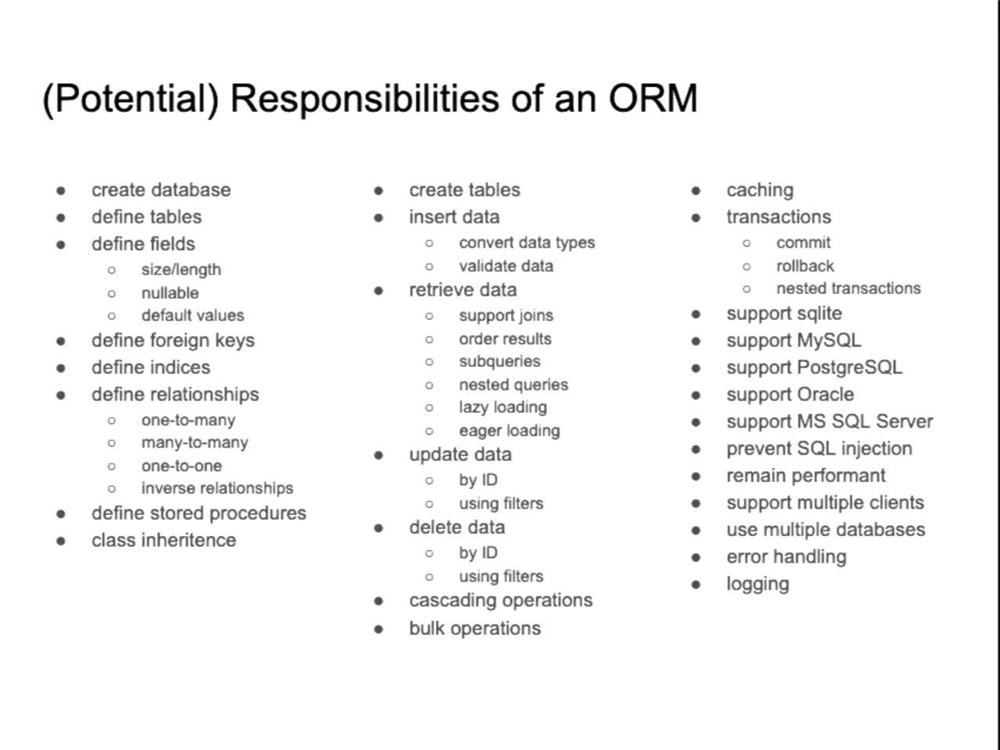

## (Potential) Responsibilities of an ORM

-   create database
-   define tables
    -   define fields
        -   size/length
        -   nullable
        -   default values
    -   define foreign keys
    -   define indices
    -   define relationships
        -   many-to-many
        -   one-to-many
        -   one-to-one
        -   inverse relationships
    -   define stored procedures
    -   class inheritance
-   create tables
    -   insert data
        -   convert data types
        -   validate data
    -   retrieve data
        -   support joins
        -   order results
        -   subqueries
        -   nested queries
        -   lazy loading
        -   eager loading
    -   update data
        -   by ID
        -   using filters
    -   delete data
        -   by ID
        -   using filters
        -   cascading operations
        -   bulk operations
-   caching
-   transactions
    -   commit
    -   rollback
    -   nested transactions
-   support sqlite
-   support MySQL
-   support PostgreSQL
-   support Oracle
-   support MS SQL Server
-   prevent SQL injection
-   remain performant
-   support multiple clients
-   use multiple databases
-   error handling
-   logging
